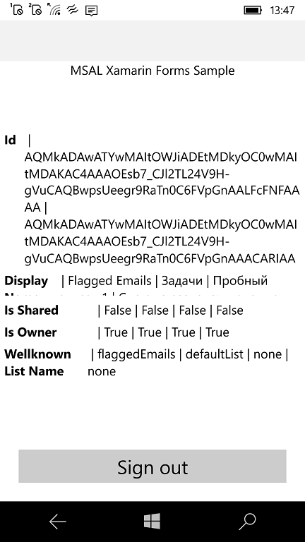

# MSTodoX
Microsoft Todo Xamarin Forms proto / draft / early bird / superlite ver. 

## Screenshot(s)

## About / Problem
MS decides to "switch off" the Task "cloud" sync at mobile version of Microsoft TODO UWP app. Date:  Feb, 15 2022.

My idea is to "recover" MS TODO for old sweet W10M & my Lumia phones.

## Goal
Try to reilize/assemble the "remake" of Microsoft TODO UWP app (W10M).

## Status 

Work in progress (just the beginning...)

### Substatus 
Re-assembling MSGraph lib....

## References (base of my work) 

- https://docs.microsoft.com/en-us/graph/use-the-api MS Graph API Use
- https://docs.microsoft.com/en-us/graph/api/resources/todo-overview?view=graph-rest-1.0  MS TODO Overview

## .. 
As is. No support. RnD only.

## .
[m][e] 2024

