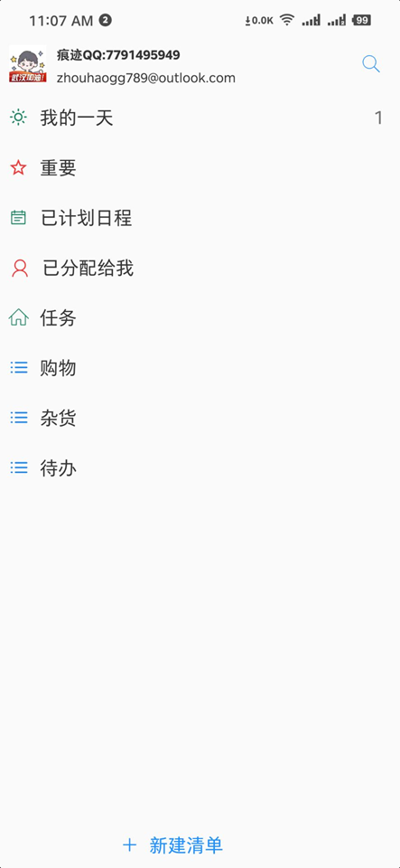

# MSTodoX
Multi-platform Microsoft Todo app, superlite version without any great design. Draft/Proto.

Dev. engine: Xamarin Forms 

## Architecture

## Status
- "Projects" list added only (draft)
- No task list yet, no task control :(
- W10M compatibility added
- Settings Page added

## Problem
MS decides to "switch off" the Task "cloud" sync at mobile version of Microsoft TODO UWP app. 
Date:  Feb, 15 2022.

MS ToDo fow W10M needed to task syncing via Microsoft Graph.

## Goal
Try to reilize/assemble the smalest (simplified) "remake" of Microsoft TODO UWP app (W10M).

## References (base of my work) 

https://docs.microsoft.com/en-us/graph/use-the-api

https://docs.microsoft.com/en-us/graph/api/resources/todo-overview?view=graph-rest-1.0

## ..
AS IS. No support. RnD only / DIY

##
[m][e] 2022--2023